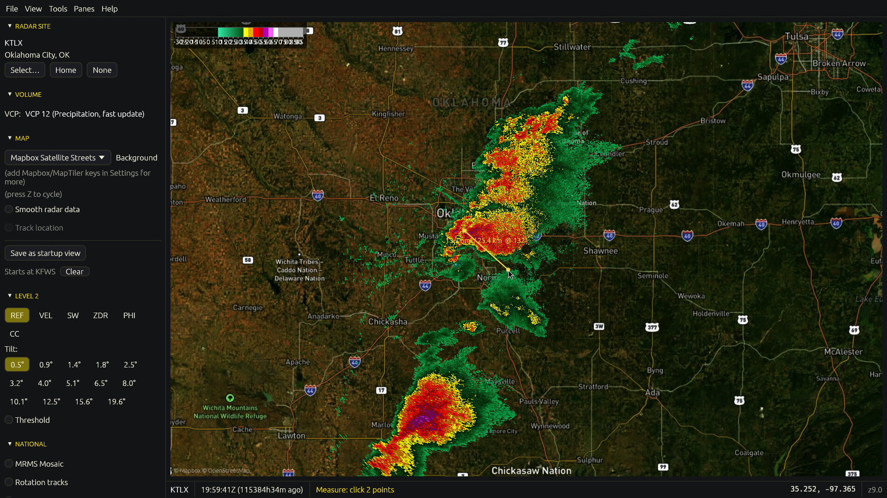
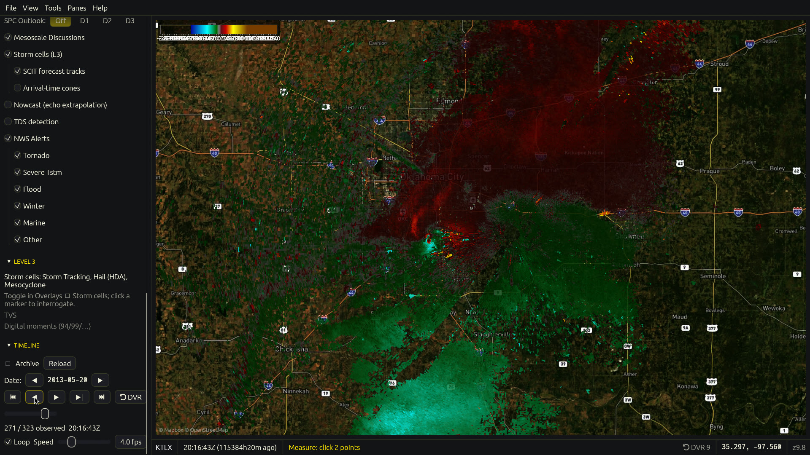
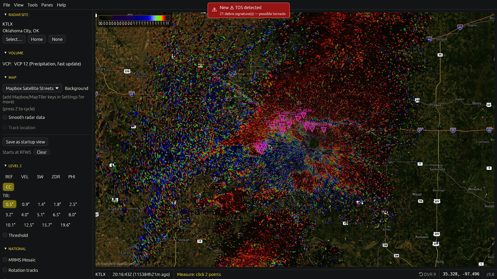
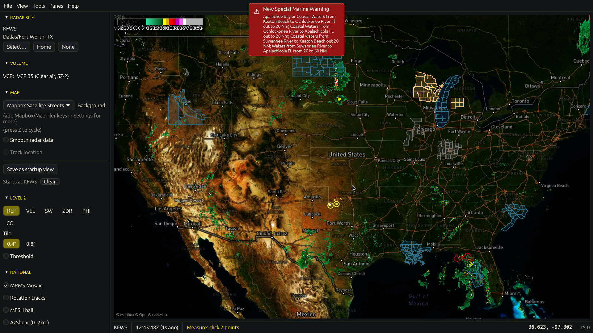
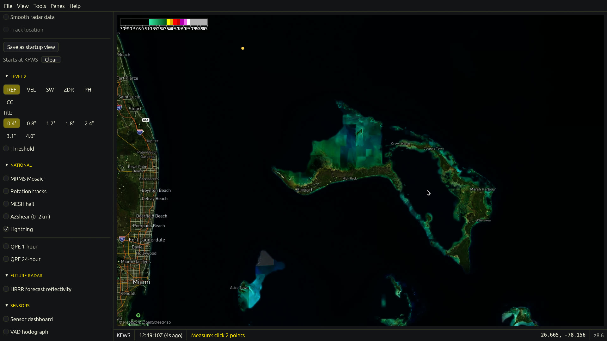
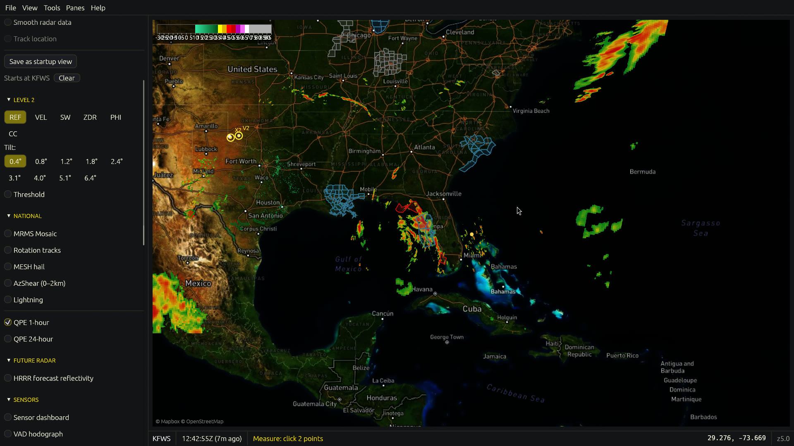
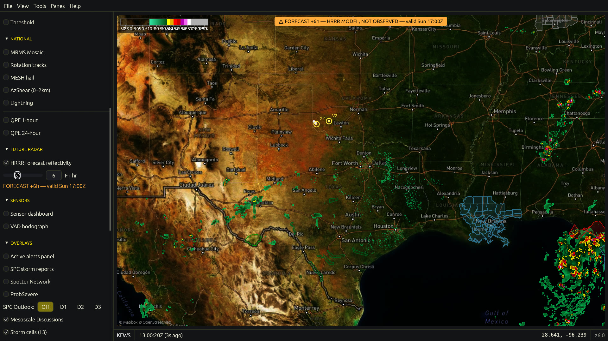
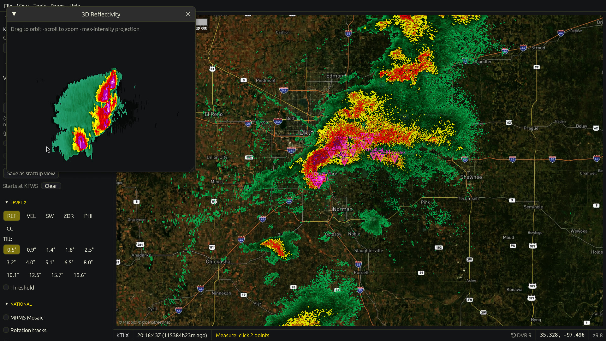
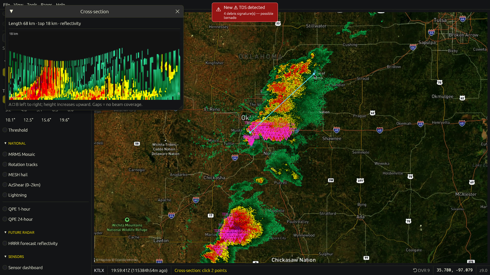
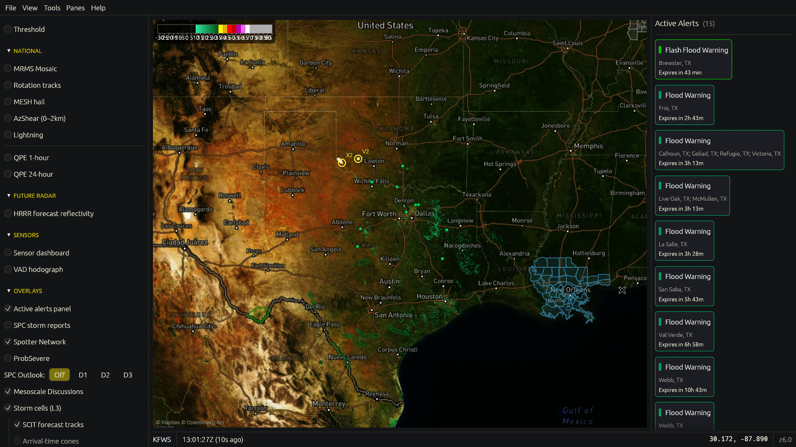

# Hook Echo-WX

Advanced NEXRAD weather radar viewer — an open-source homage to
[supercell-wx](https://github.com/dpaulat/supercell-wx), built from scratch in Rust
with `wgpu` + `egui`. Deep per-site Level 2 / Level 3 analysis plus national
situational awareness (MRMS), forecast environment overlays, and warning
intelligence — on Windows, Linux, and Android.

## Install

- **Linux**: download `Hook_Echo-WX-x86_64.AppImage` from
  [Releases](../../releases), `chmod +x`, run.
- **Windows**: grab the installer from [Releases](../../releases) —
  `Hook_Echo-WX-setup-x86_64.exe` (setup wizard) or `Hook_Echo-WX-x86_64.msi`
  (MSI, for scripted/enterprise installs). A portable
  `hookecho-windows-x86_64.zip` is there too: unzip, run `hookecho.exe`.
- **Android** (arm64, Android 10+): sideload `Hook_Echo-WX-arm64-v8a.apk` from
  [Releases](../../releases) (`adb install -r …`, or open it on-device with
  "install unknown apps" enabled). The same Rust app as desktop, as a
  `NativeActivity` — see [`android/README.md`](android/README.md).
- **From source**: `cargo run --release` (needs a Rust toolchain; on Linux also
  ALSA/Wayland/GTK dev headers — see `.github/workflows/ci.yml`). Android builds
  via `android/build.sh` (NDK + `cargo-ndk`).

First launch opens a three-step setup wizard: pick your home radar site, a theme
(13 built in), and how warnings should reach you (chime and/or
[ntfy.sh](https://ntfy.sh) push to your phone). Re-run it anytime from
**Help → Setup wizard**.

## Walkthrough

**Level 2 base data** — all six moments on a GPU polar pipeline over vector/raster
basemaps, with VCP-aware tilt selection, velocity dealiasing, storm-relative
velocity, and GRLevelX `.pal` color tables (editable in-app):

| Reflectivity | Velocity (dealiased) | Correlation coefficient |
|---|---|---|
|  |  |  |

**National view (MRMS)** — CONUS composite reflectivity, cloud-to-ground lightning
density, rotation tracks / azimuthal shear, MESH hail size + 24-h hail swaths,
storm-total QPE flood layers, surface precipitation type, and FLASH flash-flood
recurrence intervals:

| Composite | Lightning | 1-h QPE |
|---|---|---|
|  |  |  |

**Forecast & analysis** — HRRR future radar with an observed→forecast timeline
scrub, HRRR CAPE/SRH environment overlays, 3D volume raymarching, vertical
cross-sections, CAPPI altitude slices, VAD hodograph, point soundings:

| HRRR future radar | 3D volume | Cross-section |
|---|---|---|
|  |  |  |

**Warnings & alerts** — clickable NWS bulletins with polygon overlays, parsed
storm-motion vectors with projected paths, escalation-aware alerting, an
active-alerts panel, audible cues, and ntfy push the moment a warning covers one
of your saved locations:



## Feature highlights

- **Warning intelligence**: each warning's `eventMotionDescription` is parsed
  into a storm-motion vector — warned-storm dot, projected 15/30/45/60-min path,
  and ETA readouts to your saved locations. Escalation tiers (CONSIDERABLE →
  DESTRUCTIVE/observed tornado → **Tornado Emergency / PDS**) drive a pulsing
  polygon outline, priority sorting in the alerts panel with red threat chips,
  a dedicated emergency siren, and `urgent`-priority phone push.
- **Storm analysis**: SCIT cell tracks + past tracks + arrival-time cones,
  hail/mesocyclone flags, auto **tornado debris signature (TDS)** detection
  (low CC + high Z → chime/push), NOAA **ProbSevere** per-storm
  severe/tor/hail/wind probabilities.
- **Severe environment**: HRRR CAPE (surface-based or mixed-layer parcel) and
  storm-relative helicity (0–1 or 0–3 km) as translucent map overlays; point
  soundings (Skew-T/hodograph) with derived **SBCAPE / LCL / SRH / SCP / STP /
  EHI** composite indices (real parcel ascent + Bunkers storm motion); the VAD
  wind-profile hodograph; and the WFO's **Area Forecast Discussion** in-app.
- **Gridded Level 3**: Digital VIL (DVL), Enhanced Echo Tops (EET), and
  **Hydrometeor Classification (HHC)** — rain / snow / hail / graupel /
  biological — for the active site, decoded by the from-scratch packet-16
  (Digital Radial Data Array) decoder: BZIP2 symbology blocks, ICD float16
  thresholds, 0.25-km and 1-km bin sizes, MetPy-golden-tested.
- **Surface obs**: METAR station plots — wind barbs (US convention),
  temperature/dewpoint, flight-category-colored stations, greedy decluttering,
  raw METAR on hover.
- **Tropical**: active NHC storms with forecast cones, track lines, and
  Saffir–Simpson category-colored forecast points; layer ids discovered at
  runtime so NHC MapServer drift can't break it.
- **Outlooks**: SPC Day 1–3 categorical convective outlooks, plus Day-1
  probabilistic tornado/wind/hail grids with the significant-severe (SIG) hatch.
- **Nowcast**: 0–45 min optical-flow radar extrapolation from storm motion,
  alongside hourly HRRR model future radar (0–18 h) on the timeline's forecast
  tail.
- **Time machine**: archive playback of any date since 2008 — with the storm-based
  warning polygons **and the local storm reports** that were actually in effect
  at the scrubbed instant (IEM archives), a curated historic events library, and
  bookmarks.
- **Safety**: My-Locations warning monitoring, lightning proximity alarm
  (strike within ~15 km of a saved spot → chime/push), live NWS Local Storm
  Reports (minutes-fresh, tornado/wind/hail/flood), and the Spotter Network
  overlay (contact info stripped at parse).
- **Aviation**: SIGMET/AIRMET hazard polygons (convective, turbulence, icing,
  IFR) with the raw bulletin on click.
- **Climatology**: click anywhere → historical tornado tracks near that point
  (SPC 1950–2022 database) with EF-scale histogram.
- **Radar DVR**: deep in-RAM decode buffer with one-touch instant replay (`R`).
- **Streamer/OBS mode**: chrome-free UI (`F8`) + auto-tour of active warnings (`F9`).
- Multi-pane layouts, placefiles, sensor dashboard, CAPPI altitude slicer,
  range rings + azimuth spokes, 13 themes, tray + background alerting,
  screenshot/GIF/MP4 loop export.

## Workspace

- `crates/nexrad-level3` — from-scratch NEXRAD Level 3 (RPG) product decoder:
  storm-cell packets (15/19/20/23) and digital radial arrays (packet 16,
  DVL/EET/HHC), golden-tested against MetPy.
- `crates/wxdata` — data plumbing: Level 2 (AWS), MRMS, HRRR (future radar +
  environment fields), NWS alerts + storm motion/escalation, IEM archived
  warnings + live/archived LSRs, SPC outlooks/climatology, METAR, NHC tropical,
  aviation SIGMETs, Area Forecast Discussions, ProbSevere, placefiles, spotters,
  TDS detection, sounding indices (parcel CAPE / Bunkers SRH / SCP / STP),
  CAPPI/cross-section/3D resampling.
- `crates/hookecho` — the app: egui UI + wgpu render pipelines.
- `vendor/gribberish` — vendored GRIB2 decoder (PNG-packing + MRMS
  local-parameter fixes; grep `hookecho patch:`).

## Verification

Every data-backed feature has a headless CLI verifier (renders a PNG or prints a
report without opening a window), e.g.:

```sh
cargo run --release -- --headless out.png KTLX --moment VEL --dealias
cargo run --release -- --headless-mrms mosaic.png
cargo run --release -- --headless-alerts                    # motion + escalation lines
cargo run --release -- --headless-archwarn 2013-05-20T20:00:00Z
cargo run --release -- --headless-env sbcape cape.png       # sbcape|mlcape|srh1|srh3
cargo run --release -- --headless-field preciptype ptype.png
cargo run --release -- --headless-l3grid hhc KTLX hca.png   # dvl|eet|hhc
cargo run --release -- --headless-metar KTLX
cargo run --release -- --headless-tropical
cargo run --release -- --headless-cappi KTLX 3 cappi.png
cargo run --release -- --headless-reports 2013-05-20T19:00Z 2013-05-20T21:00Z
cargo run --release -- --headless-afd KTLX
cargo run --release -- --headless-aviation
cargo run --release -- --headless-indices -97.5 35.3
```

```sh
cargo test    # 114 offline unit tests
```

License: MIT.
