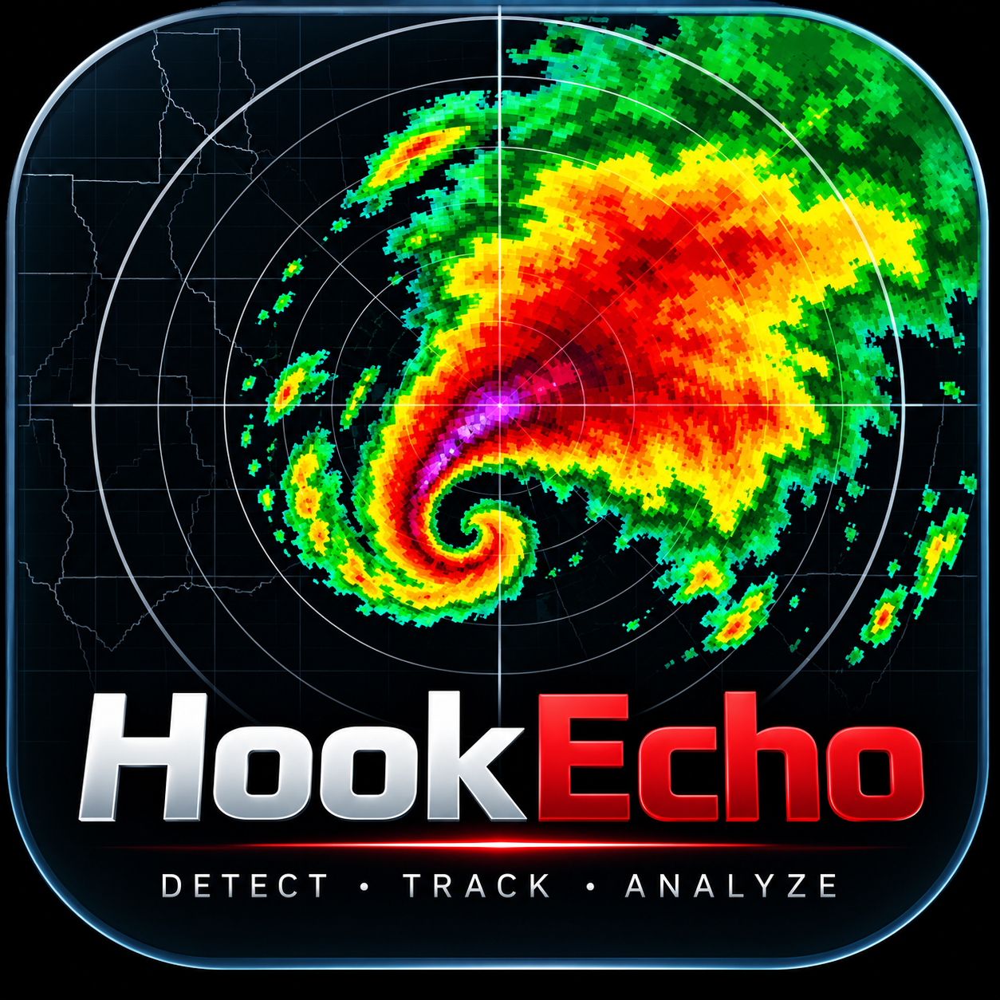
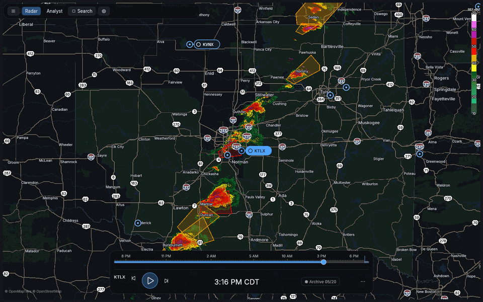
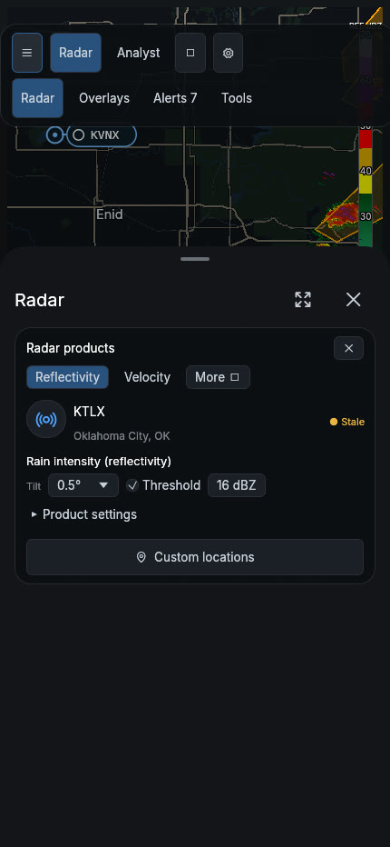
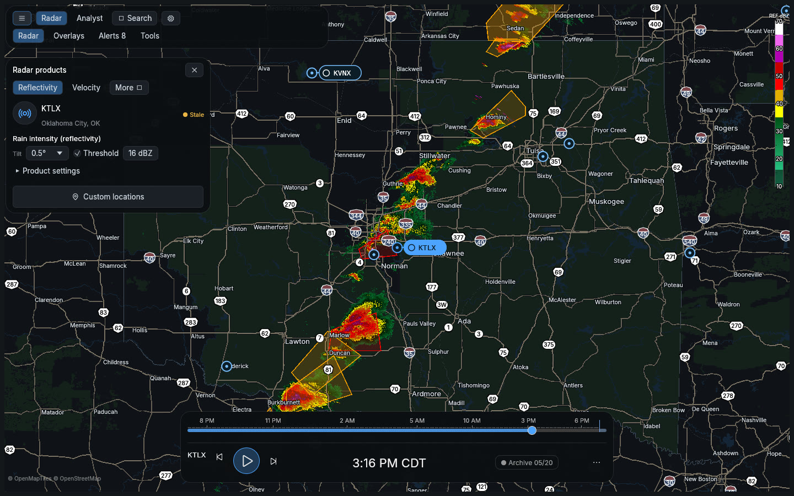
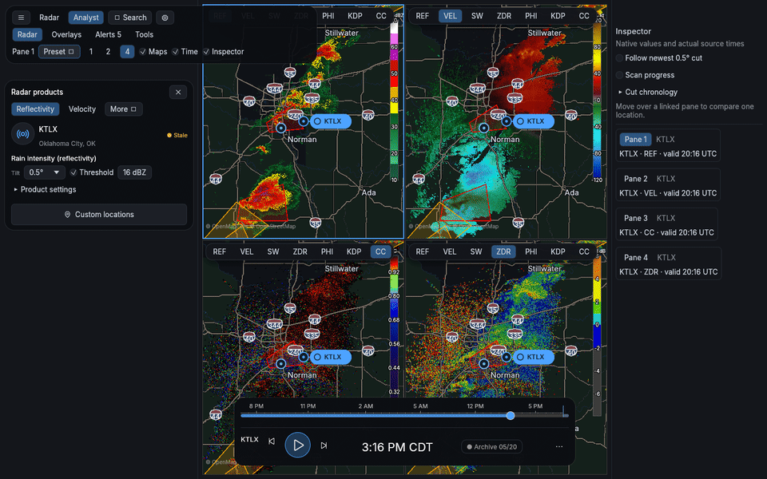
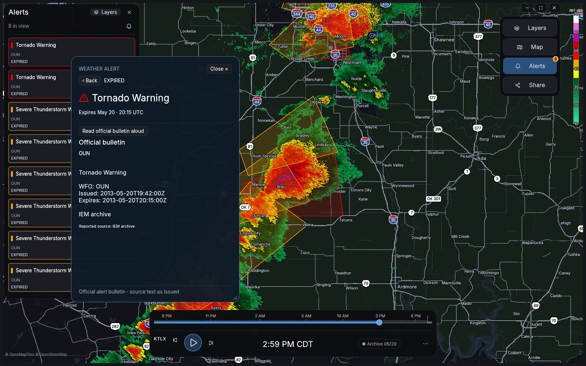
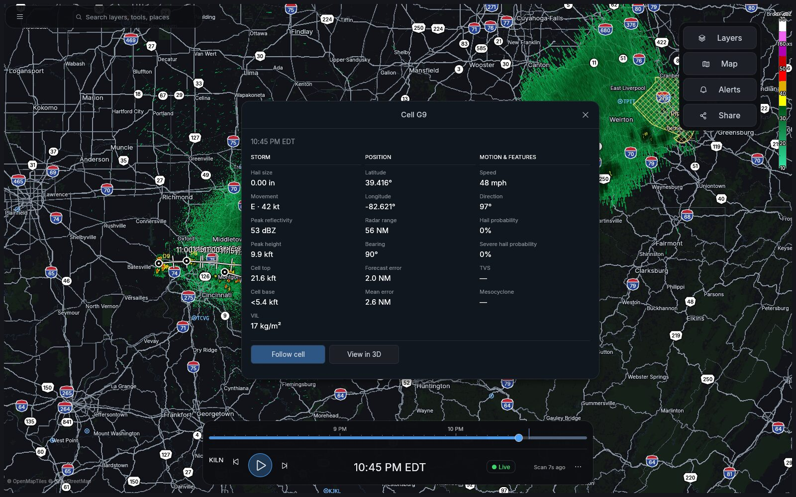

<p align="center">
  
</p>

# HookEcho

**Live weather radar without the clutter.**

HookEcho helps you see where rain and storms are, where they are moving, and whether a warning
affects you. Open it in a browser or install the app on Windows, Linux, Android, or Mac.

No account. No ads. No API key. Free and open source.

[Open live radar](https://app.hookecho.io/) ·
[Download the app](https://github.com/d4vid87/hookecho/releases/tag/latest) ·
[Visit the website](https://hookecho.io/) ·
[Get help](https://github.com/d4vid87/hookecho/issues)



*Current interface, KTLX archive replay · May 20, 2013.*

## On a phone



Browser capture of the current interface. [Phone instructions](https://hookecho.io/docs/on-your-phone/) include the Android build.

## Radar and Analyst

**Radar** opens with one map and a timeline. Its short menu separates Radar,
Overlays, Alerts, and Tools. The fixed header keeps Radar, Analyst, search, and
Settings within reach even when the menu is closed.

**Analyst** adds linked panes, presets, an active-pane label, and an optional
inspector. Choose Radar again to restore the single map you left; return to
Analyst to resume its arrangement. Save a workspace to keep it across restarts.

| Radar mode | Analyst Workstation |
| --- | --- |
|  |  |



[Follow the mode and menu guide](docs/INTERFACE.md) · [Read it on hookecho.io](https://hookecho.io/docs/radar-and-analyst/)

## More weather views

| Reflectivity | Velocity |
| --- | --- |
|  |  |

| Layers and observations | Storm attributes |
| --- | --- |
|  |  |

| Warning bulletin | Tornado emergency |
| --- | --- |
|  |  |



[See the complete screenshot gallery](docs/technical-reference.md#screenshots).

## Start here

The quickest way to use HookEcho is to [open the radar in your browser](https://app.hookecho.io/).
There is nothing to install.

On your first visit:

1. Let HookEcho use your location to choose the closest radar, or search for a place.
2. The newest radar picture opens automatically.
3. Press **Play** to watch the rain and storms move.
4. Press **LIVE** at any time to return to the newest picture.

You can install the website on a phone, tablet, or Chromebook from your browser's **Add to Home
Screen** or **Install app** option.

## Install the app

The installed app is useful when you want a dedicated window, stronger alerts, saved workspaces,
or deeper weather tools.

Open the [latest build](https://github.com/d4vid87/hookecho/releases/tag/latest), then choose the
file for your device.

| Your device | File to choose | What to do |
|---|---|---|
| Windows 10 or 11 | `HookEcho-setup-x86_64.exe` | Open the file and follow the installer. |
| Ubuntu or Debian Linux | `HookEcho-amd64.deb` | Double-click the file, or use the short command below. |
| Other 64-bit Linux computers | `HookEcho-x86_64.AppImage` | Make the file runnable, then open it. |
| Android 10 or newer | `HookEcho-arm64-v8a.apk` | Open the file and allow installation from your browser or Files app when asked. |
| Mac | `HookEcho-macos.zip` | Unzip it and open HookEcho. The Mac version is still experimental. |

For Ubuntu or Debian:

```sh
sudo apt install ./HookEcho-amd64.deb
```

For the AppImage:

```sh
chmod +x HookEcho-x86_64.AppImage
./HookEcho-x86_64.AppImage
```

Windows or Mac may warn that HookEcho is from an unknown developer. On Windows, choose **More
info → Run anyway**. On Mac, open **System Settings → Privacy & Security → Open Anyway**.

HookEcho is currently in beta. Please [report anything that does not work](https://github.com/d4vid87/hookecho/issues/new).

## What you can do

- Watch live rain and storms move across the map.
- See official weather warnings and open the full message.
- View lightning, rainfall, wind, clouds, smoke, and other useful layers.
- Tap anywhere for the local forecast.
- Save important places and receive nearby warning alerts.
- Look ahead with future radar.
- Replay major storms and past radar scans.
- Change the map style, colors, units, and alert sounds.
- Compare several radar views when you want more detail.

Everyday controls stay simple. The deeper weather tools remain available without crowding the
main map.

## Find your way around

- **Radar | Analyst:** choose one map or resume your analysis arrangement.
- **Search or Ctrl+S:** find a place, radar, setting, or weather layer. Escape closes search or the menu.
- **Play button:** animate recent radar pictures.
- **Timeline:** move backward through recent scans or forward into future radar.
- **LIVE button:** jump back to current conditions.
- **Radar section:** site, product, tilt, threshold, and custom locations.
- **Overlays section:** storm tracks, MRMS, storm attributes, and SPC outlook.
- **Alerts section:** see warnings covering the area on screen. It stays closed until you open it.
- **Tools section:** search the product catalog and open saved workspaces.
- **Settings gear:** open Settings directly from the fixed header.


## Made for different kinds of weather watchers

**For everyday use:** open the map, see whether rain is coming, and read warnings without learning
radar terms.

**For outdoor plans:** save home, work, events, or travel stops and watch the weather near each
place.

**For weather enthusiasts:** compare radar products, split the screen, inspect storm structure,
use forecast layers, and replay historic events. These tools stay tucked away until you ask for
them.

## Alerts

HookEcho can warn you when official weather alerts approach a saved place. Depending on your
device, alerts can appear in the app, browser, phone notification, email, Discord, Telegram, or
another service you connect.

The app explains what the warning is, where it is, and when it expires. It can read warnings in
the visible map area through the bundled Piper voice; emergency speech interrupts routine notices.

## Privacy

HookEcho has no user accounts, ads, or app tracking. Radar, forecasts, and warnings come from
public weather services. Your saved places and preferences stay on your device unless you choose
to connect a syncing or alert service.

## Need help?

- **The map chose the wrong area:** search for your town, postcode, or nearest radar.
- **Radar looks old:** press **LIVE** and check the time shown at the bottom.
- **A layer is missing:** open **Layers** and turn it on.
- **Location was blocked:** search manually; location access is optional.
- **The installed app will not open:** try the browser version first, then report your device and operating system.

Questions are welcome in [GitHub Issues](https://github.com/d4vid87/hookecho/issues) or on
[Discord](https://discord.gg/VNMW2Gyg4V).

## For technical users

The [technical reference](docs/technical-reference.md) covers advanced radar products, data
sources, workspaces, remote control, Home Assistant, MQTT, plugins, command-line options,
development, and testing.

- [User guide](docs/GUIDE.md)
- [Radar and Analyst interface](docs/INTERFACE.md)
- [Weather-data guide](docs/DATA.md)
- [Plugin guide](docs/plugins.md)
- [Sync guide](docs/sync.md)
- [Contributing](CONTRIBUTING.md)
- [Project roadmap](ROADMAP.md)

## License

HookEcho is free and open source under the [GNU GPL v3](LICENSE).
