# Hook Echo-WX

[](https://github.com/d4vid87/hookecho/actions/workflows/ci.yml)
[](../../releases)
[](#license)


Advanced NEXRAD weather radar viewer — an open-source homage to
[supercell-wx](https://github.com/dpaulat/supercell-wx), built from scratch in Rust
with `wgpu` + `egui`. Deep per-site Level 2 / Level 3 analysis plus national
situational awareness, forecast environment overlays, and warning intelligence —
on Windows, Linux, and Android.

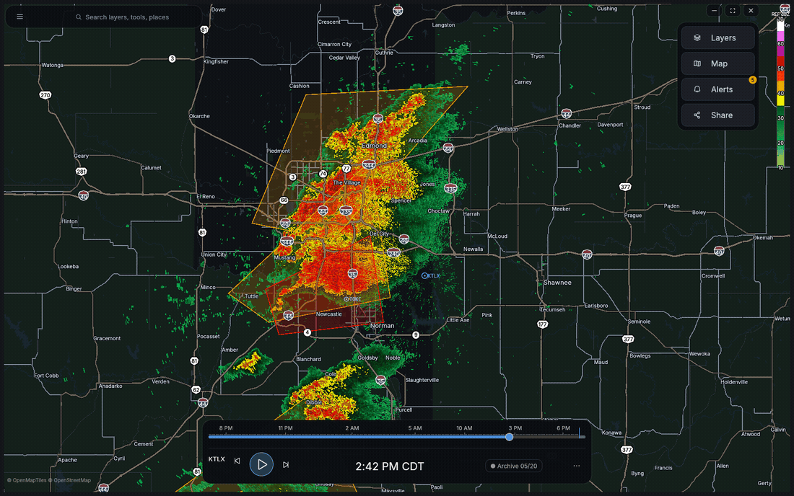

<sub>**KTLX 0.5° reflectivity — Moore, Oklahoma, 20 May 2013.** Replayed from the
public archive inside the app, one scan every few seconds, with the tornado
warning that was in force at the time.</sub>

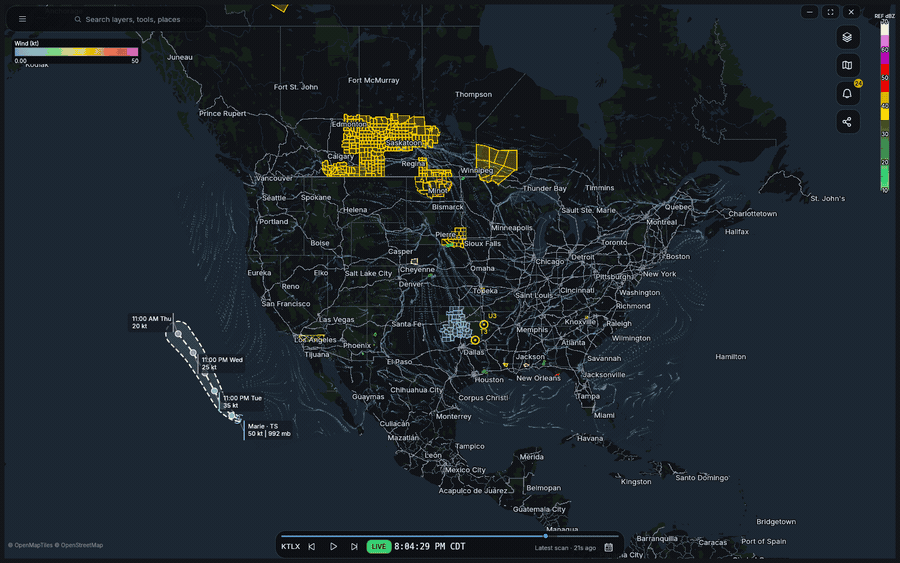

<sub>**Animated wind.** HRRR 10 m wind as drifting particles coloured by speed —
built from NOAA's free GRIB grids, so it needs no API key.</sub>

## Install

- **Linux**: download `Hook_Echo-WX-x86_64.AppImage` from
  [Releases](../../releases), `chmod +x`, run.
- **Windows**: grab the installer from [Releases](../../releases) —
  `Hook_Echo-WX-setup-x86_64.exe` (setup wizard) or `Hook_Echo-WX-x86_64.msi`
  (MSI, for scripted/enterprise installs). A portable
  `hookecho-windows-x86_64.zip` is there too: unzip, run `hookecho.exe`.
- **Android** (arm64, Android 10+): sideload `Hook_Echo-WX-arm64-v8a.apk` from
  [Releases](../../releases) (`adb install -r …`, or open it on-device with
  "install unknown apps" enabled). The same Rust app as desktop, as a
  `NativeActivity` — see [`android/README.md`](android/README.md).
- **From source**: `cargo run --release` (needs a Rust toolchain; on Linux also
  ALSA/Wayland/GTK dev headers — see `.github/workflows/ci.yml`). Android builds
  via `android/build.sh` (NDK + `cargo-ndk`).

Versioned `v*` releases are the stable channel. Every push to `main` also
refreshes a [`latest`](../../releases/tag/latest) rolling prerelease carrying the
same five artifacts, if you want the newest work without waiting for a tag.

First launch opens a setup wizard: pick your home radar site, a theme (13 built
in), and how warnings should reach you (chime and/or [ntfy.sh](https://ntfy.sh)
push to your phone). After that, three one-time callouts point at the controls
you'll actually use. Re-run the wizard anytime from the sidebar's **App → Setup wizard**.

## The interface

Hook Echo-WX is a map with its controls docked around it — no menu bar, no
floating cards over the weather:

- **The left sidebar** holds everything: the site, the current product and its
  tilt, the expert knobs for that product, then every layer, window and tool —
  searchable, scoped by category pills, and described in plain English, with the
  layer options, map settings and app commands under it. `Ctrl+K` jumps to its
  search, and Enter runs the top match.
- Its **Alerts tab** lists every alert covering your view, worst first, badged
  with the count. Click a row to fly there and read the bulletin.
- **The bottom bar** is the timeline: site, clock, play, scrub, and a LIVE badge
  that snaps back to the newest scan. Right-click the badge for the archive day,
  loop and playback speed.
- **The right edge** is the color scale for whatever product the active pane is
  showing.

That's the whole of it. Searching for a place is the same box — type a name and
take the **Fly to** row at the bottom of the results.

| Pick a product | One sidebar for everything |
|---|---|
| 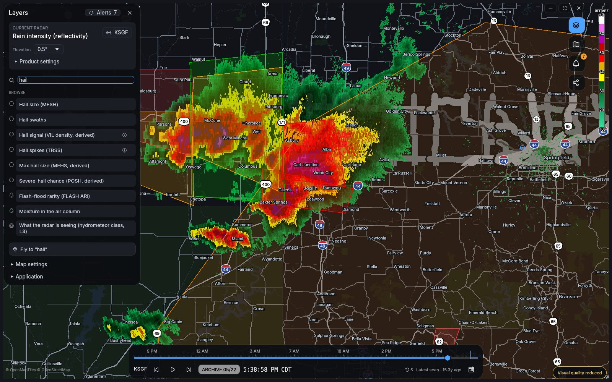 | 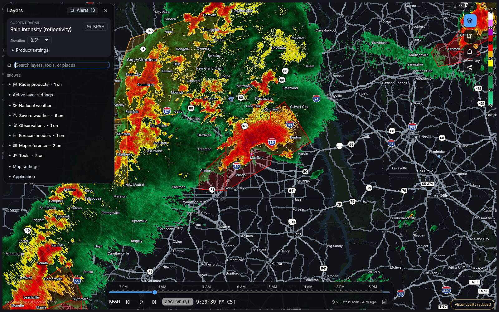 |
| <sub>Joplin, MO — 22 May 2011</sub> | <sub>Mayfield, KY — 11 Dec 2021</sub> |

Radar times read in **the selected radar's local time**, not Zulu — a KEPZ pane
shows MDT while a KTLX pane shows CDT, side by side. Settings → Units puts it
back to UTC if you'd rather work in Zulu.

Every expert control is still there, in the sidebar's **Layer options** section,
which shows a layer's settings only once that layer is on — so the forecast-hour
slider appears when you turn on future radar, and stays out of the way when you
haven't.

Search a place in the sidebar and it flies there, with a **Save marker** button
if you want to keep it. Markers are what the warning, lightning and rain-arrival
alerts watch. Tap one on the map to rename or remove it.

## Walkthrough

*Storm screenshots are historic events replayed through the app's own archive
timeline — the same scrubbing you'd do live. Forecast and national layers are
live data, captured as they came in. Everything is on the Mapbox Satellite
Streets basemap; a dozen others ship too, from a dark vector map to GOES
satellite imagery.*

### Watching a storm

All six Level 2 moments on a GPU polar pipeline, with VCP-aware tilt selection,
velocity dealiasing, storm-relative velocity, and GRLevelX `.pal` color tables.
Reflectivity shows you the storm's structure; velocity shows you what it's doing —
the tight red-against-green couplet below is a tornado on the ground.

| Reflectivity | Velocity (dealiased) |
|---|---|
| 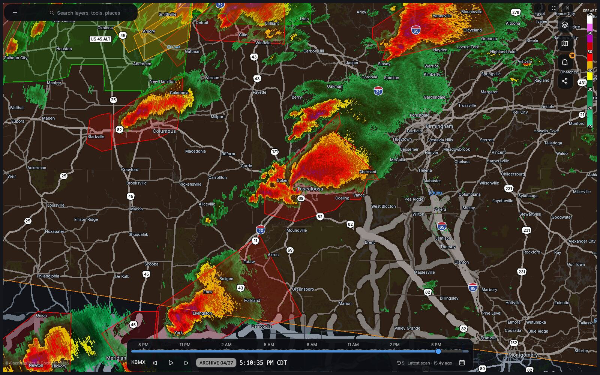 | 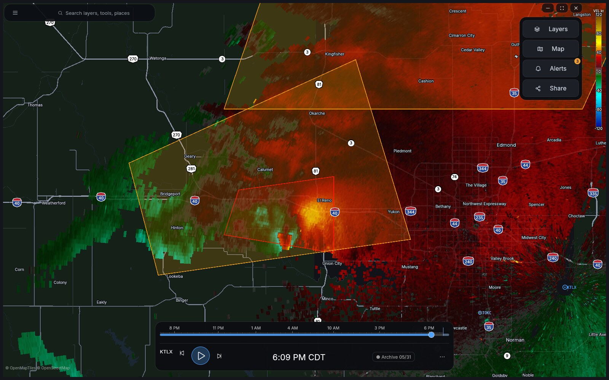 |
| <sub>KBMX — Tuscaloosa, AL, 27 Apr 2011</sub> | <sub>KTLX — El Reno, OK, 31 May 2013</sub> |

Split the window into four panes and give each one its own product, cameras
linked — reflectivity, velocity, correlation coefficient and differential
reflectivity on the same storm at the same second. One action does the same
trick with four tilts instead, so you can see how a storm leans with height.
Cross-sections slice it vertically in any product — click two points and you get
the storm in profile, core and overhang and all.

| Four products at once | Cross-section |
|---|---|
| 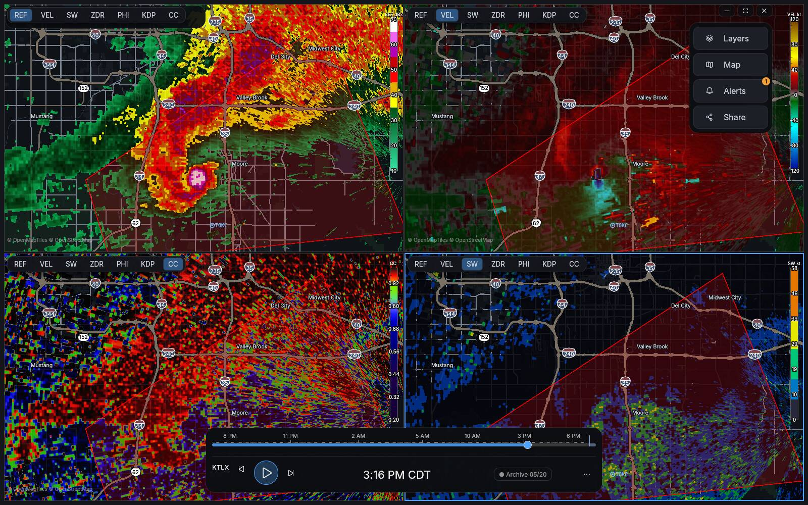 | 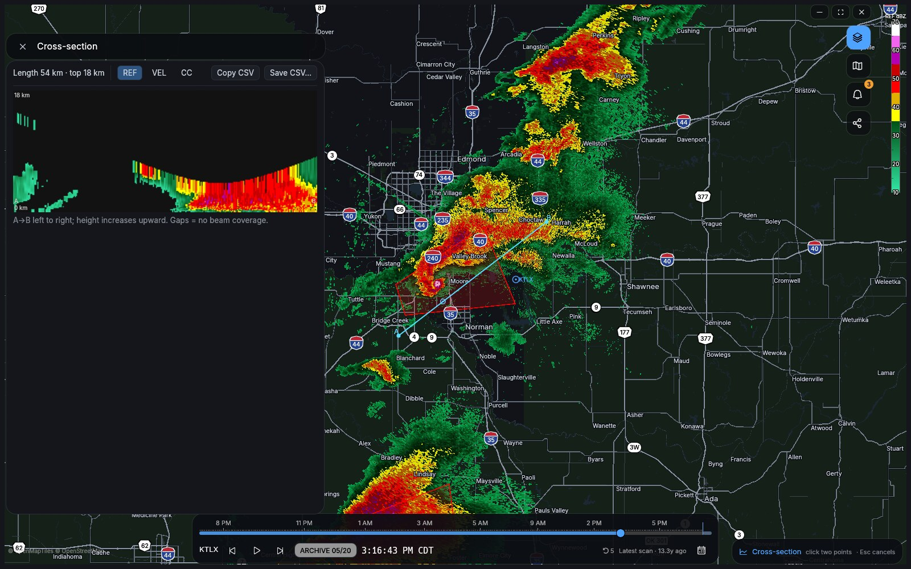 |
| <sub>KTLX — Moore, OK, 20 May 2013</sub> | <sub>KTLX — Moore, OK, 20 May 2013</sub> |

Every screenshot in this section is a replay. The timeline reaches back to June
1991, so any archived storm loads the same way the live one does — a supercell
from fifteen years ago, or a hurricane coming ashore:

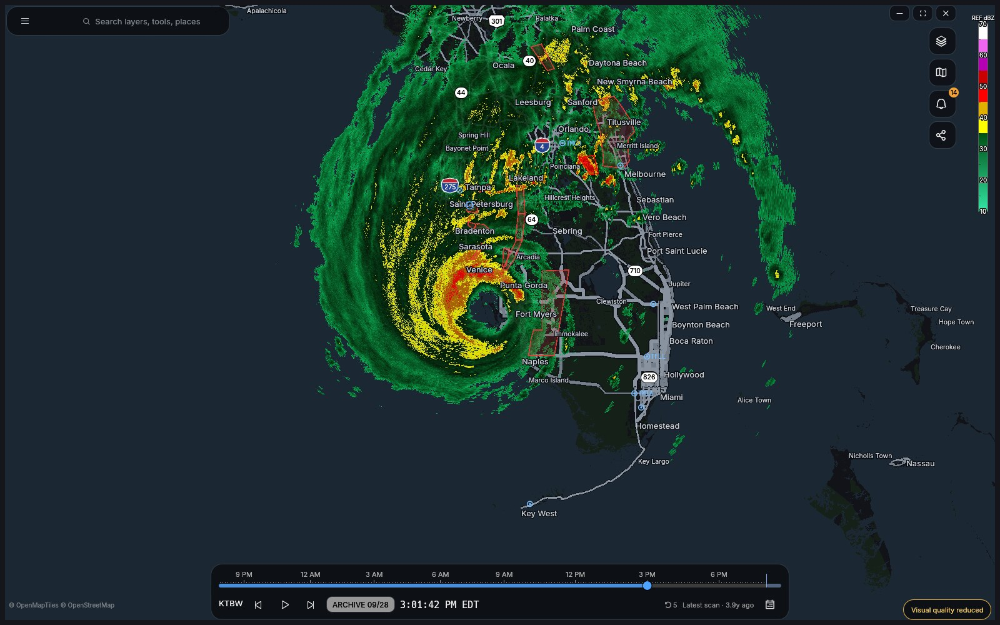

<sub>**KTBW 0.5° reflectivity — Hurricane Ian, 28 September 2022.**</sub>

And because the archive is there, you can ask how the warnings did. The
verification lab scores an office's warnings for a day against the storm reports
that came in — POD, FAR, CSI, lead times, and the individual rows behind them,
including the reports nobody warned for (the red dots on the map). The
arbitration is the Iowa Environmental Mesonet's, so the numbers agree with the
published ones instead of being a private opinion.

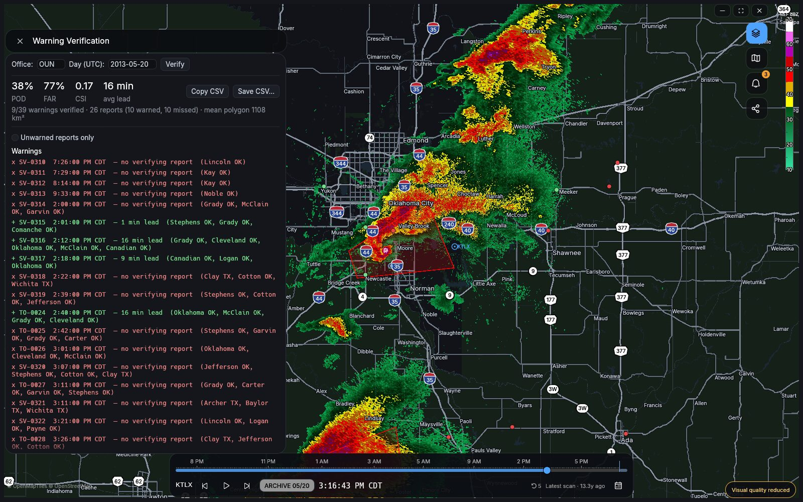

<sub>**KTLX — 20 May 2013.** OUN's warnings scored against that day's reports.</sub>

### Deciding which storm matters

Every tracked cell in one sortable table — hail size, tops, VIL, rotation flags —
and clicking a row flies you there. Alongside it, an active-alerts panel sorted
worst-first, with clickable NWS bulletins and parsed storm-motion vectors. Scrub
into the archive and the panel fills with the warnings that were actually in
force at that moment.

| Storm attributes | Active alerts |
|---|---|
| 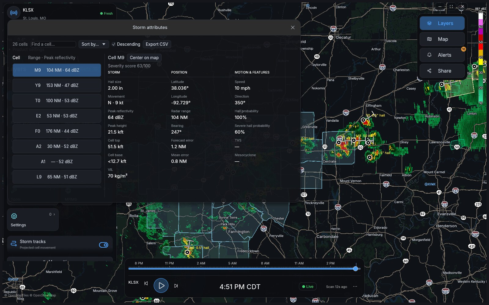 | 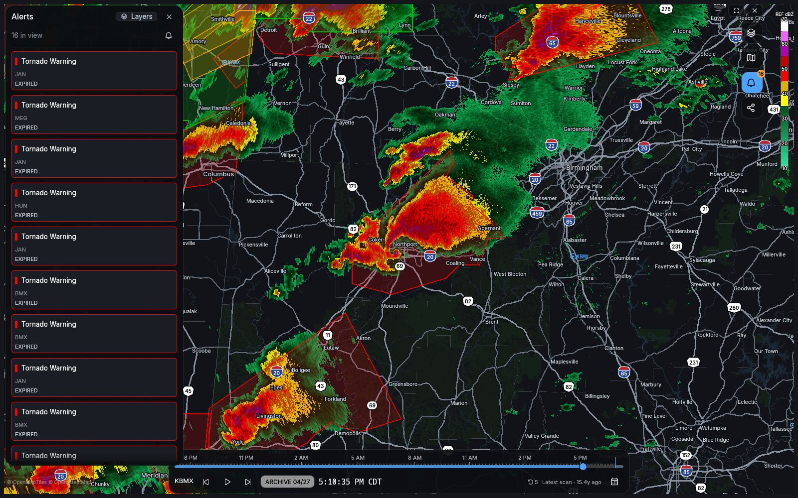 |
| <sub>KBMX — live</sub> | <sub>KBMX — 27 Apr 2011 outbreak</sub> |

### Looking ahead

HRRR future radar rides the timeline's forecast tail, so scrubbing past the
present keeps going into the model. It is labeled the whole time it is on —
model output should never be mistaken for something a radar actually saw.

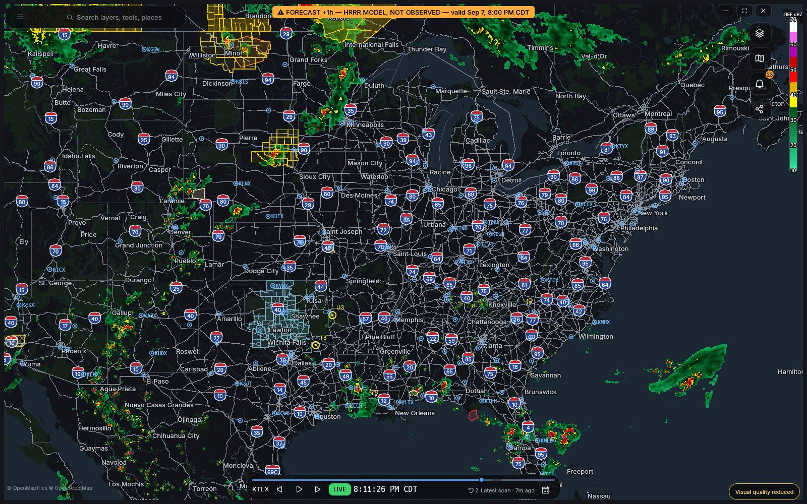

<sub>**HRRR future radar, +1 h.** The banner stays up for as long as the layer is
on: forecast, not observed.</sub>

Any point on the map gives you the plain NWS forecast for that spot, and the WPC
surface analysis draws the national weather map — fronts with their proper pips,
highs and lows with pressures.

| Surface analysis | Point forecast |
|---|---|
| 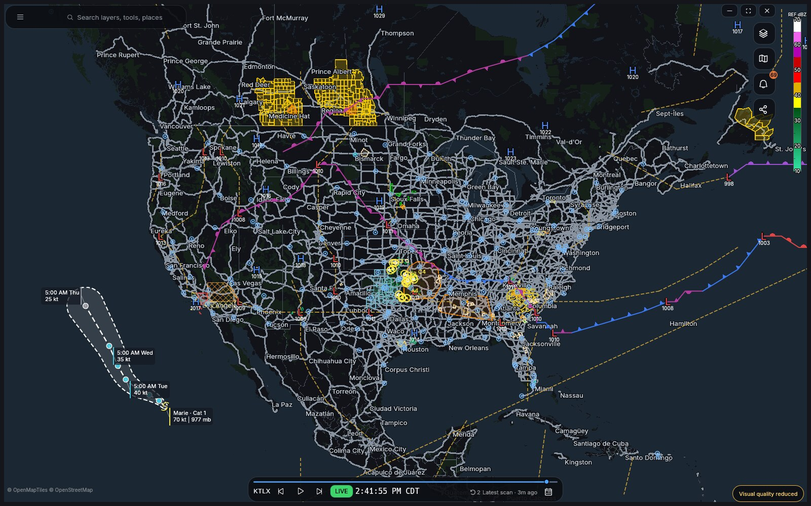 | 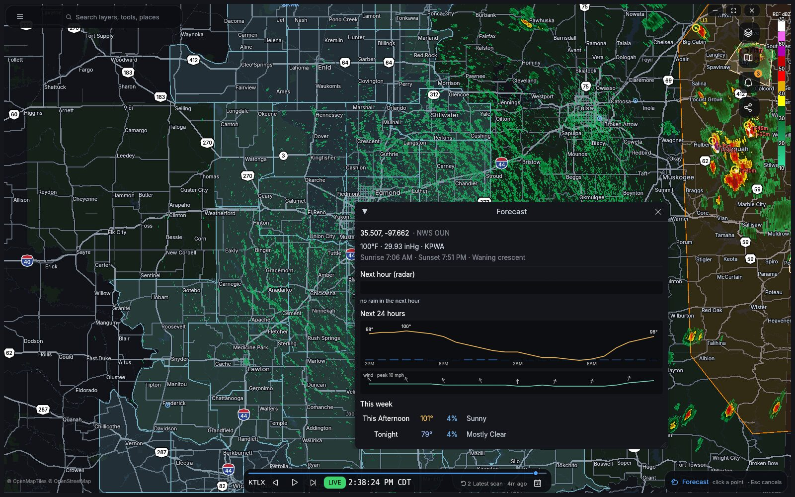 |
| <sub>WPC coded surface analysis, live</sub> | <sub>Tap anywhere — KBMX, live</sub> |

Also on the forecast tail: **rotation tracks** (HRRR max updraft-helicity swaths
— where storms are forecast to rotate, accumulated across the hours you scrub
to) and near-surface **wildfire smoke**.

### The national picture

Every radar in the country stitched into one mosaic, updated every couple of
minutes — the view for "what's happening everywhere" rather than "what's
happening here" — plus rainfall accumulated over the last hour or day.

| National mosaic | 24-hour rainfall |
|---|---|
| 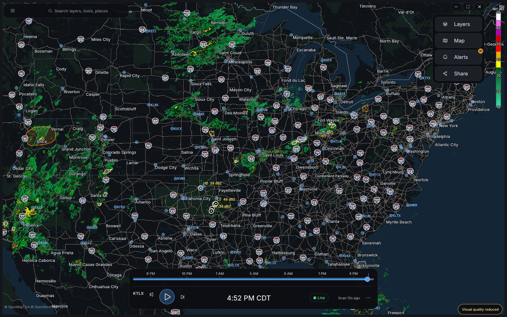 | 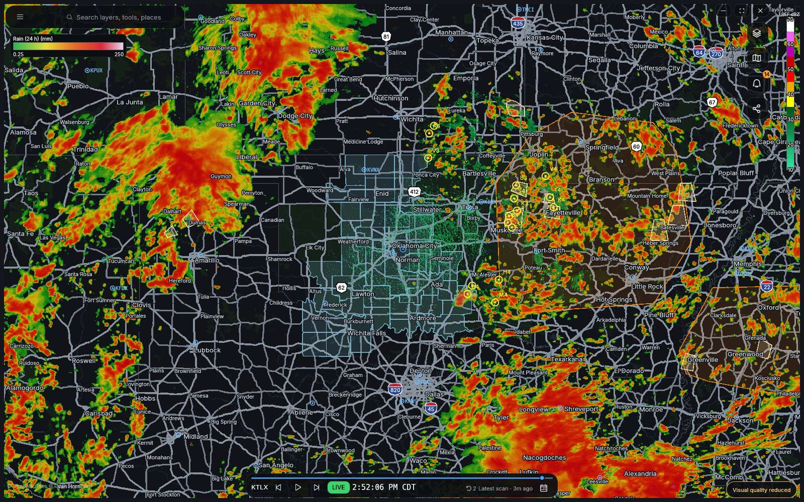 |
| <sub>MRMS composite reflectivity, live</sub> | <sub>MRMS gauge-corrected precipitation, live</sub> |

There is also a **multi-radar mosaic** built the other way round: instead of a
national 1 km product, every radar covering your view contributes its own base
reflectivity at full resolution, composited nearest-radar-wins so neighbouring
sites join without a seam. It shows which radars it used and how old the oldest
scan in it is, because radars scan on their own schedules and a composite is
never one instant.

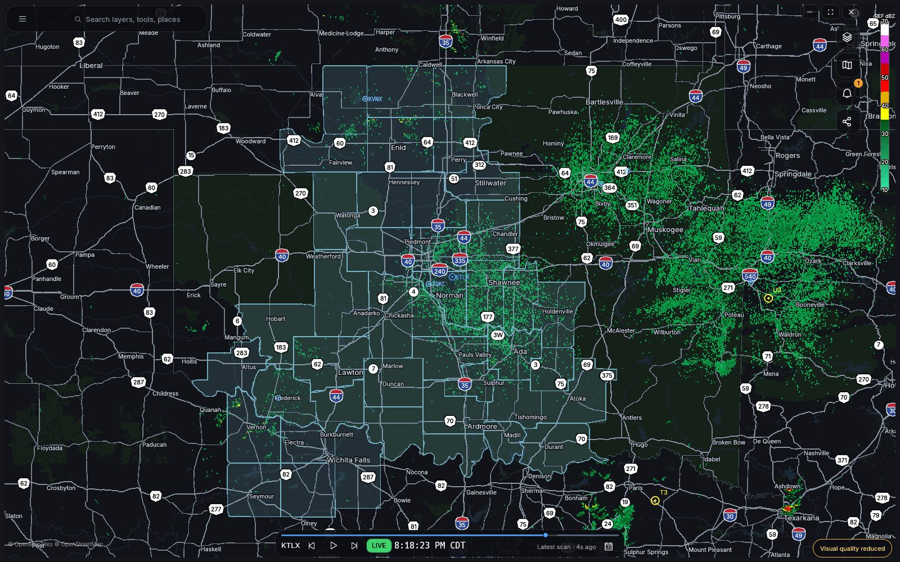

<sub>Six radars, one picture — live N0B composite</sub>

Alongside them: individual lightning flashes from the GOES satellite's lightning
mapper (fading as they age), cloud-to-ground lightning density, rotation tracks
and azimuthal shear, MESH hail size and 24-hour hail swaths, surface
precipitation type, and FLASH flash-flood recurrence intervals. Every gridded
layer draws its own scale and units.

## Features

### Warnings and alerting

- Each warning's `eventMotionDescription` is parsed into a storm-motion vector —
  warned-storm dot, projected 15/30/45/60-minute path, and ETA readouts to your
  saved locations.
- **Home marker with a watch radius**: mark one saved location as home and set
  how close a warning has to come (20 miles by default) — you're alerted when
  the polygon's *edge* reaches that ring, not only when it swallows your house.
  Every marker carries its own radius; home draws its ring on the map.
- Escalation tiers (CONSIDERABLE → DESTRUCTIVE/observed tornado → **Tornado
  Emergency / PDS**) drive a pulsing polygon outline, priority sorting with red
  threat chips, a dedicated emergency siren, and `urgent`-priority phone push.
- Warnings are read aloud through the system voice — the desktop speech engine,
  or Android's own TTS on the phone.
- Watched-location monitoring, a lightning proximity alarm (a strike within
  ~15 km of a saved spot), rain-arrival alerts ("rain in about 20 minutes"), and
  live NWS Local Storm Reports, minutes fresh.

### Storm analysis

- SCIT cell tracks, past tracks and arrival-time cones; hail and mesocyclone
  flags; a sortable attributes table for every tracked cell at once.
- Automatic **tornado debris signature** detection (low correlation coefficient
  collocated with high reflectivity) and client-side azimuthal-shear couplet
  detection on the live volume — a rotation flag that doesn't wait for a Level 3
  product.
- NOAA **ProbSevere** per-storm severe/tornado/hail/wind probabilities.
- Cross-sections in any moment, a CAPPI altitude slicer, and a 3D volume view.

### Environment and forecast

- CAPE (surface-based or mixed-layer parcel) and storm-relative helicity (0–1 or
  0–3 km) as map overlays, from either the **HRRR forecast (3 km)** or the **RAP
  f00 analysis (13 km)** — the observed mesoanalysis, assimilated from obs rather
  than projected forward. Same switch drives the contour fields and the
  STP/SCP/EHI composites.
- Point soundings — Skew-T and hodograph — with derived **SBCAPE / LCL / SRH /
  SCP / STP / EHI** indices from real parcel ascent and Bunkers storm motion,
  and the **observed radiosonde ascent** from the nearest station drawn dashed
  beside the model profile (University of Wyoming archive, so an event replay
  gets that morning's real balloon, back to 1973).
- The VAD wind-profile hodograph, plus a time-height panel of wind barbs
  accumulated while the app runs, since the radar only publishes the latest.
- HRRR future radar (0–18 h), forecast rotation tracks, near-surface wildfire
  smoke, and 0–45 minute optical-flow extrapolation of the radar you're watching.
- SPC Day 1–3 categorical outlooks plus Day-1 probabilistic tornado/wind/hail
  grids with the significant-severe hatch, and the WFO's **Area Forecast
  Discussion** in-app.

### Products computed from the volume itself

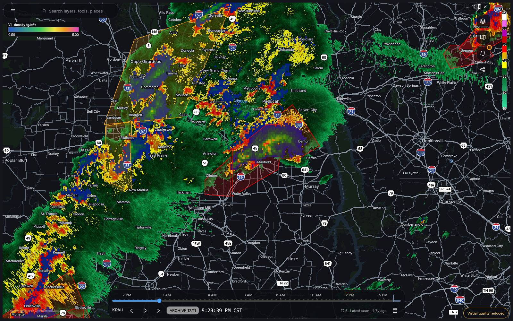

<sub>VIL density over the Mayfield, KY supercell — computed here from the 11 Dec
2021 volume, four years after it was recorded.</sub>

- **VIL, VIL density and echo tops**, integrated here from the stacked tilts
  rather than read from a Level 3 grid — so they work in **any archive replay**,
  at the volume's own resolution, with an echo-top threshold you can move.
- **Maximum expected hail size and probability of severe hail** (Witt et al.
  1998), with the melting-level and −20 °C heights the algorithm needs sourced
  automatically from HRRR instead of typed in by hand. Live only: those heights
  come from the current analysis, and applying today's freezing level to a storm
  from 2021 would be an answer with no meaning.

### Data the app decodes itself

- **Gridded Level 3**: Digital VIL, Enhanced Echo Tops and **Hydrometeor
  Classification** (rain / snow / hail / graupel / biological), via a
  from-scratch packet-16 decoder — BZIP2 symbology blocks, ICD float16
  thresholds, 0.25-km and 1-km bins, golden-tested against MetPy.
- **GOES satellite lightning**: individual flashes from the GLM, ~40 seconds
  behind real time. GLM sees in-cloud flashes a ground network never reports.
  The netCDF-4 granules go through a from-scratch minimal HDF5 reader
  (`crates/hdf5lite`), because the reference C library can't ship in the Android
  build.
- **METAR station plots** with US-convention wind barbs, flight-category colors
  and greedy decluttering — extended offshore and over the Great Lakes by the
  **NDBC buoy network**, where the airport network simply has no stations.
- **TDWR terminal radars**: the FAA's airport radars, synthesized into volumes
  from their Level 3 tilt products, so all 44 of them behave like any other site.
- **NHC tropical** storms with forecast cones and Saffir–Simpson-colored track
  points, the **forecast wind field** at 34/50/64 kt, **potential storm surge**,
  and **hurricane-hunter flight tracks** with the measured SFMR surface wind.
- **SIGMET/AIRMET** hazard polygons and **PIREPs** — what pilots actually flew
  through, rather than what was forecast.
- **Winter**: HRRR forecast snowfall, the **NOHRSC observed snowfall analysis**
  (6/24/48/72 h), the **Winter Storm Severity Index** — how disruptive, not just
  how much — and **mPING** crowd reports of what is actually falling.
- **WPC Excessive Rainfall Outlook**, the flood half of a severe-weather day.

### Time machine

- Archive playback of any date since June 1991, with the warning polygons **and
  the local storm reports** that were actually in effect at the scrubbed instant.
  Volumes from before the dual-polarization upgrade simply don't offer ZDR/CC.
- A curated library of historic events, plus your own bookmarks.
- An in-RAM decode buffer with one-touch instant replay (`R`), and
  screenshot / GIF / MP4 loop export.

### Across your machines

- **Sign in with Google** (Settings → Sync) and your settings, saved locations,
  placefiles, palettes and API keys follow you to every machine. The data lives
  in your own Drive's hidden per-app folder — no Hook Echo account, no server,
  and a scope that cannot see the rest of your Drive. Screen scale and device
  name stay local. One-time OAuth client setup: [docs/sync.md](docs/sync.md).

### Out in the field

- **Chase mode**: live GPS (gpsd on desktop, the system location service on
  Android) drawn as a blue dot on the radar, a storm-relative HUD with closest
  approach and escape bearing, and offline "chase packs" of pre-downloaded
  basemap tiles.
- **Position sharing**: opt in and every Hook Echo on the same network sees
  everyone else's dot, no account and no configuration (UDP broadcast on
  :41777). For devices that aren't on one network — the phone chasing on
  cellular, the desktop at home — set a relay URL in the same panel: any HTTP
  endpoint you host that takes `POST` of one position and returns `GET` of the
  list. There is no default relay; the endpoint sees your live position.
- **Streamer/OBS mode**: chrome-free UI (`F8`) and an auto-tour of active
  warnings (`F9`).
- Click anywhere for historical tornado tracks near that point (SPC 1950–2022)
  with an EF-scale histogram, plus how often that spot has actually been warned —
  warning counts by type, first year on record, busiest year and worst day.
- **NWS damage surveys**: the EF-rated damage points and surveyed track a survey
  crew filed after the storm, with photos, on the day your timeline is showing.
  Ground truth to lay over the hook you were watching.
- Listen to a **NOAA Weather Radio** relay while you watch (bring your county's
  stream URL — NOAA broadcasts on VHF and streams nothing itself).
- Draw on the map freehand to circle the storm you're talking about, and look
  through webcams to see what the sky actually looks like. The FAA's ~2,600
  airport cameras need no key but stop at the US border; a free **Windy** key in
  Settings adds their global network, which returns the 50 most popular cameras
  in view rather than every one of them.
- **Animated wind**: HRRR 10 m wind drawn as drifting particles, coloured by
  speed — the Windy look, built from NOAA's own free GRIB grids rather than
  licensed, so it needs no key and works offline of any paid API. CONUS only,
  because HRRR is. Model output, not observation, and the layer says so.
- **Open this view in Windy** from the command palette when you want their
  models next to ours — same place, same zoom, matching overlay.
- **Live station cards**: click a surface station and get a floating,
  draggable card — a live highway camera on top, then the station's local clock
  and how stale its reading is, temperature with humidity and dewpoint, a wind
  dial with the trailing-gust ladder (10 s through 24 h), and the electric field.
  Open as many as you want, one per station.
  Airport METARs need no key; a **WeatherFlow Tempest** token or a **Weather
  Underground** key adds personal weather stations. Camera video is MJPEG decoded
  in-app, or HLS if you have `ffmpeg` installed — the card says so plainly when
  you don't, and everything else on it keeps working.
  Cameras come from the FAA and from **Caltrans**, whose twelve districts publish
  ~3,300 cameras keyless and stream video from most of them. No other state DOT
  publishes an open camera API, so that is the coverage, not a national map.
  The electric field is NOAA's **PPEF** model: the equatorial *ionospheric* field
  in mV/m, predicted from solar wind. That is space weather, not the storm over
  your head — for the kV/m a chaser means, point the card at a ground field
  mill's JSON in Settings and it charts that instead.
  On Android the cards work the same, minus live video: the camera shows its
  newest still instead, refreshed on the poll clock (a phone can't spawn ffmpeg,
  and a video decoder per open card is not what its battery is for).
- Multi-pane layouts, placefiles with icon sheets and a layer manager, a sensor
  dashboard, range rings, 13 themes, and tray-based background alerting.

On Android the same app wears a touch-first skin: a five-slot labeled dock
(Play · Layers · Products · Site · More), slide-up sheets, and a navigation
drawer holding the desktop sidebar's contents — same described action list,
same category pills, same layer options, same app rows — plus native GPS for chase mode and opt-in background
alerting: a foreground service watches your saved locations and notifies you
with the app closed, tiered by watch / warning / emergency, tapping through to
the storm.

### Extending it

Placefiles work as they do everywhere else — URLs, icon sheets, a layer manager with per-file
opacity and paint order. Beyond that, anything that can print a placefile can be a plugin: the app
runs your command on a cadence, hands it the current site, view box, product and **the instant on
screen** (so it works during an archive replay too), and draws what comes back. No SDK, no build
step, no language requirement — the shipped examples are a Python script and twenty lines of
shell. See [docs/plugins.md](docs/plugins.md).

## Repository layout

- `crates/hookecho` — the app: egui UI and wgpu render pipelines.
- `crates/wxdata` — data plumbing: Level 2 (AWS), MRMS, HRRR (future radar and
  environment fields), NWS alerts with storm motion and escalation, IEM archived
  warnings and live/archived storm reports, SPC outlooks and climatology, METAR,
  NHC tropical, aviation SIGMETs, Area Forecast Discussions, ProbSevere,
  placefiles, spotters, GOES GLM lightning, WPC surface fronts, NWS point
  forecasts, TDS detection, sounding indices, and CAPPI/cross-section/3D
  resampling.
- `crates/nexrad-level3` — from-scratch NEXRAD Level 3 (RPG) product decoder:
  storm-cell packets (15/19/20/23) and digital radial arrays (packet 16 —
  DVL/EET/HHC), golden-tested against MetPy.
- `crates/hdf5lite` — minimal read-only HDF5 reader, just enough for the
  netCDF-4 files NOAA publishes. Exists because the reference reader is a C
  library the Android build can't take; checked against h5py on real granules.
- `vendor/gribberish` — vendored GRIB2 decoder (PNG-packing and MRMS
  local-parameter fixes; grep `hookecho patch:`).
- `scripts/shots` — the screenshot harness that produced everything above.

## Verification

Every data-backed feature has a headless CLI verifier (renders a PNG or prints a
report without opening a window), e.g.:

```sh
cargo run --release -- --headless out.png KTLX --moment VEL --dealias
cargo run --release -- --headless-mrms mosaic.png
cargo run --release -- --headless-alerts                    # motion + escalation lines
cargo run --release -- --headless-archwarn 2013-05-20T20:00:00Z
cargo run --release -- --headless-env sbcape cape.png       # sbcape|mlcape|srh1|srh3
cargo run --release -- --headless-field preciptype ptype.png
cargo run --release -- --headless-l3grid hhc KTLX hca.png   # dvl|eet|hhc
cargo run --release -- --headless-metar KTLX
cargo run --release -- --headless-tropical
cargo run --release -- --headless-cappi KTLX 3 cappi.png
cargo run --release -- --headless-reports 2013-05-20T19:00Z 2013-05-20T21:00Z
cargo run --release -- --headless-afd KTLX
cargo run --release -- --headless-aviation
cargo run --release -- --headless-indices -97.5 35.3
cargo run --release -- --headless-glm                       # GOES satellite lightning
cargo run --release -- --headless-fronts                    # WPC surface analysis
cargo run --release -- --headless-hrrr uh 3 uh.png          # refc|uh|smoke
```

```sh
cargo test    # 184 offline unit tests
```

The screenshots in this README are regenerated by `scripts/shots/shoot.sh`,
which drives the real binary on a nested X display — see
[`scripts/shots/README.md`](scripts/shots/README.md).

## License

MIT.
