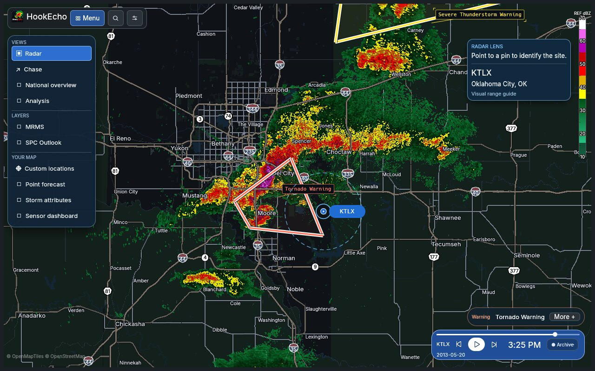
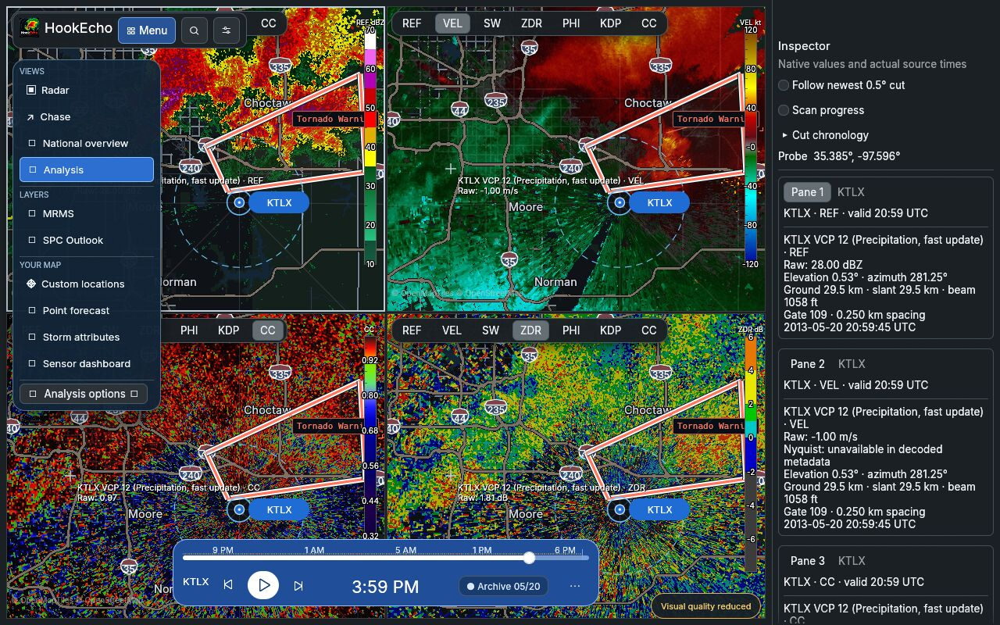
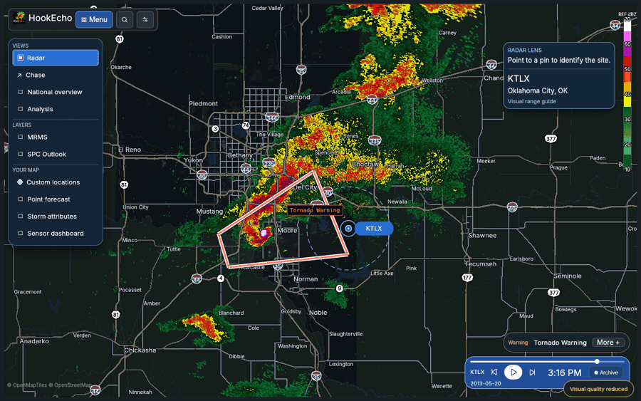

# Radar and Analyst interface

HookEcho opens in **Radar**: one map, one timeline, and a short menu. **Analyst** is an optional workbench for comparing products. The **Radar | Analyst** switch, search, and Settings stay in the fixed header, even when the menu is closed.

*Archive capture from KTLX on May 20, 2013; not current weather.*

## Find a control

| Section | Controls |
| --- | --- |
| **Radar** | Site and freshness; product, tilt, threshold, advanced product settings, Custom locations. |
| **Overlays** | Storm tracks, MRMS, storm attributes, SPC outlook. Day 1–3 and the risk legend stay together; click the selected day again to hide the outlook. |
| **Alerts** | Warning visibility and the alerts in view. The badge shows the count; incoming alerts do not open the section. |
| **Tools** | Searchable products and tools, plus saved workspaces. |

Click the gear for Settings in one step. **Ctrl+S** opens and focuses global search. **Space** plays or pauses radar; **Escape** hides or restores the map controls.

## Regional Clusters

At national and regional zooms (below zoom 7), blue regional chips replace repeated polygon labels. Each chip counts unique visible bulletins, rather than county polygon pieces. Click it to browse the region's warnings, watches, advisories, special weather statements and mesoscale discussions, then open the full bulletin. Shared county edges inside the same bulletin are suppressed at wide zoom. All enabled hazard footprints remain on the map; priority-dock thresholds do not filter them. Emergency labels stay prominent.

Zoom in for individual labels and tropical forecast timestamps. Radar sites remain selectable as small dots at wide zooms; the selected site's name stays visible. The existing layer controls, polygon inspection, tropical storm reader and single/compare views remain available.

Outline meshes are cached per pane and viewport. New feeds, camera changes, scale changes and display-density changes invalidate the cache. Offscreen rings are rejected before projecting their vertices; source polygons and hit testing retain their original detail.

## Build an analysis view

1. Click **Analyst**. On the first entry, the current radar map becomes pane 1.
2. Select a preset such as **Tornado**, or choose 1, 2, or 4 panes from the fixed analyst toolbar.
3. Click the pane to edit. Its label tells you which pane is active; radar product and overlay changes target it.
4. Enable **Maps** or **Time** to link pane positions or timeline selection. Open **Inspector** to view values and actual source times.
5. Click **Radar** to restore the previous single-map view. Click **Analyst** again to resume the analysis arrangement.

The app remembers each mode's site, camera, product, overlays, thresholds (including disabled thresholds), active pane, links, and selected live or archive time for the current session. It does not keep extra inactive renderers or downloads running. Save a workspace in Tools if you need the arrangement after restarting. Ordinary single-pane workspaces open in Radar; multi-pane and explicitly analyst workspaces open in Analyst. Older workspace files remain readable.

On a phone, the mode switch remains available and sections open in a sheet. The menu header stays fixed while content scrolls, and the pane picker lets you move between analyst panes.

For the first scan and playback controls, start with the [user guide](GUIDE.md). The [website guide](https://hookecho.io/docs/radar-and-analyst/) covers the same workflow for browser users.
